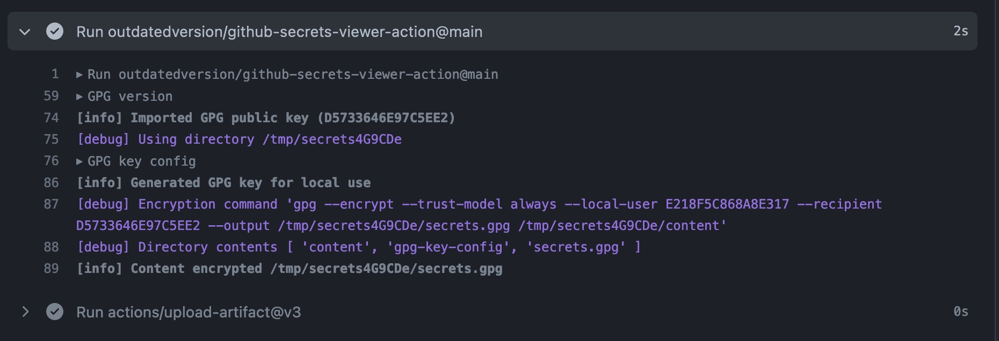

# GitHub secrets viewer action

Provides a safe approach to reading GitHub secrets since they are not accessible after being set.

## How it works

This approach uses GPG, commonly used for signing commits in the Git community, to encrypt the
provided content.

A GPG private key will be generated on every invocation of this action. That private key is used in
conjunction with a public key you provide to encrypt the provided content. You may than access, and
remove, the output on disk however works for you.

The exact code GitHub will run can be audited at `dist/index.js`.

## Example usage

```yaml
- uses: outdatedversion/github-secrets-viewer-action@v1.1
  id: viewer
  with:
    # Public key (`gpg --armor --export <keyId>`) set in a GitHub repository variable
    gpg-public-key: ${{ vars.GPG_PUBLIC_KEY }}
    secrets: |
      accessToken=${{ secrets.ACCESS_TOKEN }}
      password=${{ secrets.PASSWORD }}

- uses: actions/upload-artifact@v3
  with:
    name: secrets
    path: ${{ steps.viewer.outputs.path }}
```

The run will look something like:



Then, after download and unzipping the artifact, you can view it:

```console
$ gpg -d secrets.gpg
gpg: encrypted with 4096-bit RSA key, ID 9C591F0F99FE28CE, created 2022-11-05
      "Ben Watkins <hi@bwatkins.dev>"
accessToken=abc
password=$$##^@($&AAJKHFJKH333
```

I recommend removing these steps when you're done debugging.

<details>
  <summary>You could also load secrets from a file if that's more convenient:</summary>

```yaml
- uses: outdatedversion/github-secrets-viewer-action@v1.1
  id: viewer
  with:
    # Public key (`gpg --armor --export <keyId>`) set in a GitHub repository variable
    gpg-public-key: ${{ vars.GPG_PUBLIC_KEY }}
    secrets-path: build.env

- uses: actions/upload-artifact@v3
  with:
    name: secrets
    path: ${{ steps.viewer.outputs.path }}
```

Note: `secrets-path` (e.g. `build.env`) is _not_ automatically deleted after `viewer` runs

</details>

## Support

Tested against:

- Node.js v16 actions runtime
- gpg (GnuPG) 2.2.27 (used by `ubuntu-22.04`)

This will probably work with other Linux runner images.

Feel free to open a pull request or issue if you run into issues or have thoughts.

## Similar things

- Meir Gabay posted a how-to article on using OpenSSL to protect sensitive content in actions on
  [their website](https://meirg.co.il/2022/07/01/how-to-recover-secrets-from-github-actions/) and
  [on GitHub Discussions](https://github.com/orgs/community/discussions/26277#discussioncomment-3251166)

## Wishlist

- Support protected keys
